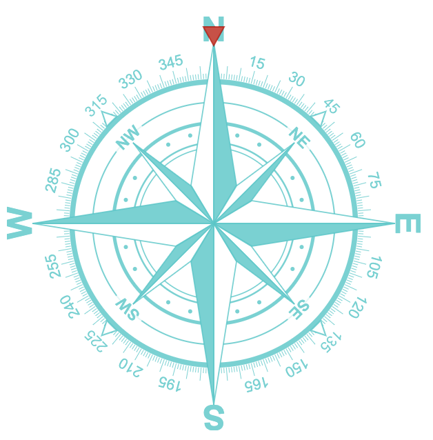

# star-compass



# usage

```javascript
import StarCompass from './dist/star-compass.js'

const canvas = document.querySelector('canvas.star-compass')

const color = 'rgba(0, 200, 200, 0.8)' // option
const indicator = 'rgba(200, 0, 0, 0.8)' // option

const compass = new StarCompass(canvas, color, indicator)

const angle = 270
const duration = 500 // option

compass.animateTo(270, 500)
```
